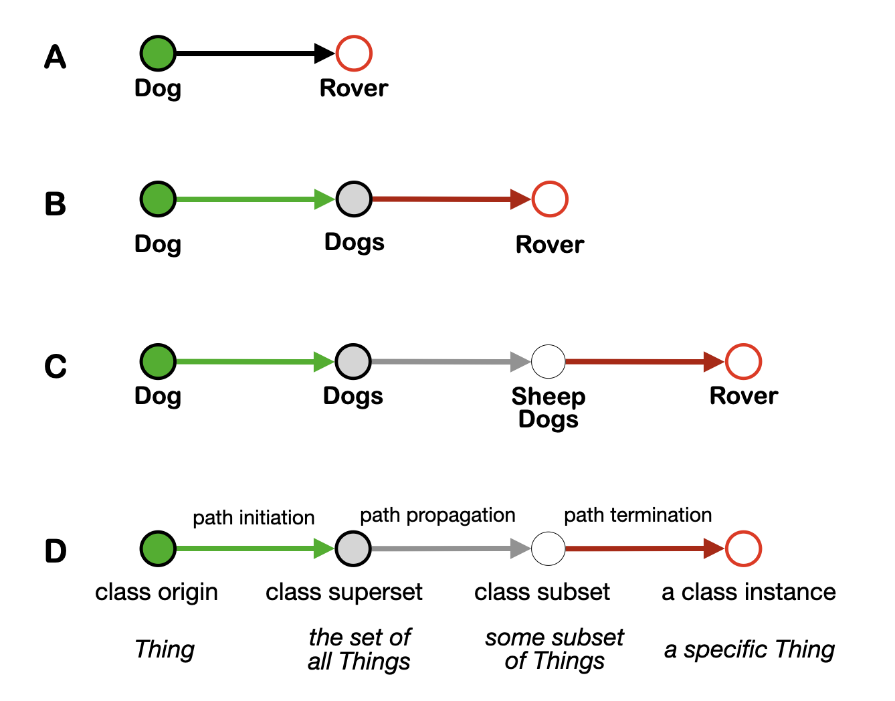

back to the [foundations of tapestry theory table of contents](https://github.com/wds4/tribal-tapestry/blob/main/essays/bookJustification/hypotheses/tapestryFoundation.md)

The Class Threads Hypothesis
=====

Nodes of the graph are organized into sets and concepts using class threads.

-----

  
    
  
  
  
    
  

Left: Definition of a class thread. It is defined by three edge types: path initiation, path propagation, and path termination. Path initiation and termination nodes are required. There can be any number of path propagation nodes, including zero.

Right: a concept is defined in terms of a class origin node: Given the set of all class threads that emanate from a single class origin node, a concept is defined as the set of all nodes and all edges that are traversed by those threads.

What do the path edges *mean*? We interpret:
- Path propagation edges (grey arrows) mean "Node B is a subset of Node A," e.g. Sheep Dogs are a subset of Dogs. We can rename this edge type: *isASubsetOf*.
- Path termination edges (red arrows) mean "Node B is a specific instance of the class origin node," e.g. Rover is a specific instance of Dog. We can rename this edge type: *isASpecificInstanceOf*.
