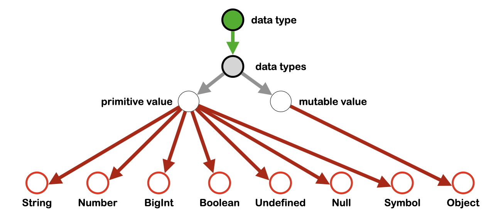

# The Cortical Tribal Tapestry Hypothesis

# Abstract 

Before we (USS and WDS4) can proceed with our celebrated Oprah Book Club selection and NYT Best Seller, *The Tribal Tapestry*, we must first come to an agreement as to 1) what the Cortical Tribal Tapestry Hypothesis actually states and 2) whether it is well formulated, novel, plausibly true, and useful. If it does not meet ALL of those requirements, it means we have nothing new to say and there is no sense writing the book – unless we want to be charlatans, repackaging tired old ideas in a new wrapper, which neither one of us wants to do. Whether or not we present the full hypothesis in all its glorious detail in the book is another matter. Some parts may be too dry and boring. But leaving it out of the book doesn't mean we don't need to discuss it first. Because there’s no way to decide which parts to include without first coming to agreement on the model itself. Below, I present the model as a series of hypotheses, each of which layer upon the ones before it.

# The Claim

I claim that the CTTH is all of the following.

- well formulated: a coherent theory that is substantive and falsifiable
- novel: none (with maybe a few pseudo-exceptions) of the 15 hypotheses below exist in the literature
- plausible
- useful

# Counterclaim

- not substantive
- not novel
- implausible
- not useful

# Hypotheses

The CTTH is a series of hypotheses, listed below, each of which builds upon the ones before it. The first one is the launching pad.

## 1. The representation of knowledge in the brain is profoundly influenced by the mandate to facilitate *social linguistic consensus* (SLC).

The organization of the brain is determined primarily by the need to address the problem of [social linguistic consensus](https://github.com/wds4/tribal-tapestry/blob/main/glossary/socialLinguisticConsensus.md). We need a universal language to get the ball rolling. That universal language is methematics. Specifically: graph theory (see below) and set theory (see below).

## 2. Knowledge in the cortex is organized as a graph.

Knowledge is broken down into small chunks, called nodes, and organized into a graph. This is not exactly controversial or new. It's hard to imagine that this is NOT the case. But it's the launching pad for subsequent hypotheses.

Knowledge is represented in two layers: the *nodal layer* and the *topological layer*. First and foremost, the tapestry method is concerned with the principles of organization of the topological layer. Conversely, the tapestry method places no restrictions on the physical form and data format of individual nodes. In the biological realm, nodes are patches of neurons: cortical columns, cortical minicolumns, nuclei, or other structures. In the digital realm, a node is a digital file: a data file, an image file, anything. 

There are important differences between information storage between these two methods. The topological layer can store information more efficiently and is well suited as a means to search for patterns, discover new relationships, and generate hypotheses. However, information retrieval is much more efficient (faster) from the nodal layer. Much of the brain's "up time" is likely spent updating the graph with new information. Much of the brain's "down time" (sleep?) is likely spent on 1) the coputationally expensive process of mining the graph for data, the results of which can be stored in nodes, and 2) optimizations of graphical topology. I say this based on my experience applying the tapestry method in the digital realm.

## 3. To achieve SLC, the principles by which structure is imposed over the graph must be as simple and universal as possible.

Structure is imposed on the graph by *principles of organization*. The mandate to achieve social linguistic consensus dictates that these principles must be as simple and universal as possible.

(btw this is the part where Oprah's audience falls asleep. So might not include it in the book. But this is a large part of what makes the CTTH substantive, which is why WE need to talk about it.)

The first two principles of organization are the class thread principle and object principles.

## 4. Nodes of the graph are organized into sets and concepts using class threads.

  
    
  
  
  
    
  

Left: Definition of a class thread. It is defined by three edge types: path initiation, path propagation, and path termination. Path initiation and termination nodes are required. There can be any number of path propagation nodes, including zero.

Right: a concept is defined in terms of a class origin node: Given the set of all class threads that emanate from a single class origin node, a concept is defined as the set of all nodes and all edges that are traversed by those threads.

What do the path edges *mean*? We interpret:
- Path propagation edges (grey arrows) mean "Node B is a subset of Node A," e.g. Sheep Dogs are a subset of Dogs. We can rename this edge type: *isASubsetOf*.
- Path termination edges (red arrows) mean "Node B is a specific instance of the class origin node," e.g. Rover is a specific instance of Dog. We can rename this edge type: *isASpecificInstanceOf*.

## 5. Concepts are formatted according to constraint nodes.  

  

The purple square is a *constraint node*. It specifies formatting rules that must be follwed by each instance of that concept (red circles). In the figure, each node represents a JSON file. The constraint node specifies that each instance must have two properties, name and breed, the values of which must be strings. The file for Spot follows this format, as expected.
  
## 6. Concepts are integrated vertically using the class propagation edge and the class termination edge (2 of the 3 edges that go into the definition of class threads).

See Figure X, below. The concept of Irish Setter is integrated vertically to the concept of Dog Breed (path termination edge, red arrow) and to the concept of Dog (path propagation edge, grey arrow). Note that the *interpretations* of these two edge types (*isASubsetOf* and *isASpecificInstanceOf*, see above) remain intact.

## 7. Constraint nodes are decomposed into properties in a manner designed to facilitate and maximize horizontal integration of the graph.

  
    
  
  
  
    
  

Fig A. Decomposition of a constraint (purple square) into a tree of properties (orange diamonds). The "breed" property on the right is only allowed to have two values: Sheep Dog and Irish Setter, because those are the only two Dog Breeds that exist in the local database. We introduce a fourth edge type, the enumeration edge (blue arrow) to achieve horizontal integration of the concepts of Dog Breed and Dog.

  

Fig. X. Vertical and horizontal integration of 3 concepts.

- Dog Breed and Irish Setter are connected vertically by the *path termination* edge (red arrow).
- Dog and Irish Setter are connected vertically by the *path propagation* edge (grey arrow).
- Dog Breed and Dog are connected horizontally by the enumeration arror (blue arrow).
  
## 8. The tapestry is normalized.

Normalization means that every node is unique. The concept of normalization of a database is familiar to computer scientists and database engineers. Sometimes normalization is broken, and that happens in the CTTH, but there must always be a reason for breaking it. In the CTTH, normalization is likely broken for data redundancy (so you don't forget something important when you bump your head and microinfarct a single cortical column). See *The Thousand Brains Hypothesis* -- a very interesting book. Other reasons to break normalization also exist: multiple versions of the same node facilitate the opportinuty to experiment with minor variations to a given concept.

## 9. The topology of the tapestry is optimized to increase search efficiency.

Organization of the graph lends itself well to the algorithmic search for similarity in graphical topology between disparate regions,a.k.a. *analogies*, as well as other processes that well merit the label: *thinking*. However, such searches will be computationally very expensive. Background processing to optimize the tapestry for such searches will be important, and could be an important role for nonREM sleep.

An example of graph optimization: an *isASubsetOf* edge between Dogs and Fido would be redundant. Removal of that edge could potentially impact the computational efficiency of path searches.

## 10. Theory of mind: each tapestry must contain an internal representation (in the form of a concept) of other entities (other people).

This is a necessary prerequisite for web of trust.

## 11. Decentralized consensus is achieved using Web of Trust.

See my [15 minute slide presentation at Nostrville, Nov 2023 in Nashville](https://open.spotify.com/episode/1SYE5ooZiHaswOsXR23STp), where I propose a two-stage roadmap to build web of trust in the digital realm, followed by my [Overview of Curated Lists](https://github.com/wds4/pretty-good/blob/main/appDescriptions/curatedLists/overview.md) where I present my proof of concept for stage 1 in the form of a desktop app. 

If my web of trust can curate a list, then it can curate a graph, which is two lists: a list of nodes and a list of edges. If it can curate a graph, then it can curate the concept graph of dogs breeds and dogs and animals (above) as I learn English from my parents in the biological realm; or the concept of javascript data types as my app communicates with other apps in the digital realm (see below figure).

  

The purpose of web of trust is to DISINTERMEDIATE THE POWERFUL by giving INFLUENCE to those who best deserve it. You ask the excellent question: who decides? In a world governed by the influential rather than the powerful, the answer is that YOU have the ultimate authority, because YOU are always and evermore at the center of YOUR web of trust.

Web of trust gives INFLUENCE to those who ought to have it (and in a context-specific manner). Anyone who abuses said influence can and probably will lose it in a jiffy. This is what distinguishes INFLUENCE from POWER. 

## 12. Basic human * cognition employs two distinct modes to arrive at what it considers "truth:" the objective mode and the tribal mode.

* This probably applies to all social organisms.

There are two modalities that our brains process information to arrive at what our brains consider to be "the truth."

The objective mode is what we would call the scientific method.

The brain defaults to the objective mode except in very special circumstances when the tribal mode kicks in. Basically when the tribal narrative fiction demands it.

The tribal mode employs logical fallacy strategically to defend the tribal narrative fiction.

## 13. Toxicity serves a purpose: tribal acceptance.

The tribal narrative of most (all?) tribes contains toxic threads that serve a purpose: to set the narrative apart from all others.

The mandate as set forth by [social linguistic consensus](https://github.com/wds4/tribal-tapestry/blob/main/glossary/socialLinguisticConsensus.md) aims to be as maximally inclusive as possible.

The mandate of tribal consensus (TC) represents a reversal of SLC: it is based upon exclusion rather than inclusion. It is predicated on the notion that acceptance by the tribe demands a renunciation of The Other.

SLC aims to communicate with as many entities as possible. Tribalism aims to do the opposite: to break down into tribes. SLC facilitates influence; tribalism is the triumph of power over influence.

(On a side note: the purpose of my apps is to build influence via an implementation of SLC. It is in opposition to TC.)

## 14. The Enlightenment and postmodernism represent the rejection of the tribal mode and the objective mode, respectively.

Postmodernism represents the attempt to enshrine toxicity in the search for Truth. The triumph of the tribal mindset over the objective mindset. 

Enlightenment represents the attempt to purge toxicity in the search for Truth. The triumph of the objective mindset over the tribal mindset.

## 15. The CTTH is universally toxic.

I used *the Prime Directive* to refer to the mandate that we must all believe that toxicity apples to The Other's tribe but NEVER to MY tribe, but you did not like this name and I can never remember what name we replaced it with! What was it??

The reason the Cortical-Tribal Tapestry Hypothesis (CTTH) remains absent from the neuroscience literature because the CTTH is toxic to everyone. The CTTH exists firmly within everyone's cognitive blond spot, as evidenced by the difficulty of finding vocabulary even to state the hypothesis that is not immediately rejected as pejorative, insulting, etc. There is no non-pejorative terminology for: toxic, objective versus tribal mindset, narrative fiction. The words that are used to formulate the hypothesis are deemed objectionable. George Orwell observed that you can think about something if you don't have the right words.

*The CTTH explains why you've never heard of the CTTH.*

"Don't you see that the whole aim of Newspeak is to narrow the range of thought? In the end we shall make thoughtcrime literally impossible, because there will be no words in which to express it."
-- George Orwell, 1984

In the case of the CTTH, when the following words are used in the context of CTTH, the words themselves are deemed objectionable, rendering it impossible to state the CTTH, to have a conversation about it, and to carry it all the way to its conclusion.
- toxicity (who decides what's toxic?!?)
- narrative fiction (but what you call fiction is my lived experience!)
- objective reality (any discussion of objective reality is patronizing)
- the Prime Directive (huh?)

# Novel

The hypotheses of the CTTH is nowhere to be found within the neuroscience literature, for reasons outlined above (hypothesis 15). I challenge anyone to show me textbook, published papers, presentations, anything that articulates any of the above set of hypotheses in a substantive way. I would guess that linguists like Noam Chomsky would probably appreciated the problem of SLC, but I doubt they've ever even articulated hypothesis #1.

## 1. memory formation

Existing models of memory formation, e.g. models of long term potentiation, the role of the hippocampus, etc, do not equal the tapestry hypothesis. they don't conflict, but they are not the same.

## 2. cortical columns

Models of cortical columns do not equal the tapestry hypothesis. Indeed: models of cortical columns focus on the nodal layer, whereas the tapestry model is focused on the topological layer. In other words, the CTTH is a nice *complement* to much of the existing literature!

## 3. functional connectivity

Models of functional connectivity do not equal the tapestry method. In particular, the CTTH's *principles of organization* such as the class thread principle are absent from existing literature on functional connectivity. I suspect the CTTH will be *complementary* to existing models of functional connectivity.

## 4. Sleep

Existing models of the purpose of sleep are inadequate. Ex: We can detect that memory consolidation happens, but what exactly is it that is happening? The CTTH proposes rearrangements of the topological encoding. This level of detail is missing from current understanding. The CTTH begins to tell us where to look.

I conjecture:
- non REM sleep is for optimizations of the topology of the concept graph
- REM sleep is for readjustements of web-of-trust parameters and influence scores

# Utility

If the CTTH is substantive, novel, and true, then surely it will follow that it is useful. It's a friggin' model of knowledge representation in the brain. How could that not be useful?

But more specifically:

## 1. The model is necessary so that we can build the decentralized web. (Doesn't have to be part of the TT book.)

## 2. At the individual level: an understanding of the CTTH will help us to maximize meaning, belonging, and acceptance while minimizing the costs accociated with tribalism. 

- to diagnose pathology internally, from within one's own tribe
- to diagnose pathology in The Other's tribe and inform our decisions regarding how to respond

If my tribe's virtue signaling causes me to piss off potential friends, I should ask: is this worth it?

## 2. May yield insights into normal brain function and brain pathology, including: 

- the function of sleep (see above)
- neurodegenerative dementia: why memory loss is retrograde
- Denial, a form of self deception, does NOT necessarily imply childhood trauma. 

## 3. Ambiguity

Ambiguity is a double-edged sword. In the context of SLC, ambiguity is a strength: it allows two people to have a conversation without requiring them to define every last word infinitely down to the smallest detail, which would probably be impossible. But in the context of Tribal Consensus, ambiguity is turned into a weapon.

## 4. Fun with philosophy.

Postmodernists use ambiguity to build complex arguments that contain logical fallacies so that they can toy with the rest of us as we try to pin down the fallacies, which turns out to be akin to herding cats, because they just tweak the definitions of ambiguously-defined terms in the middle of the "discourse" to move any given fallacy from one place to a different place in their argument.

The reason paradox is deep is because toxicity in service to the tribe is the literal definition of virtue, according to the tribal mode.

Question of the day: is tribal toxicity REALLY necessary? Could we resect it, like the spleen or appendix, and do fine without it? Maybe yes, but only in a world where conflicts were impossible?

# Definitions

## 1. Toxicity

toxicity: elements of the narrative (toxic threads) that are rejected by anyone who is not a member of the tribe.

USUALLY this means: rejected by the objective mode due to false or unverifiable beliefs (wine turns into blood) or due to logical fallacies or inconsistencies.

### type 1: claims that conflict with observation or are nonfalsifiable. Examples:

- wine turns into blood
- we are descendants of the sun god of the sun
- god gave us this land
- disease is punishment by god

### type 2: logical fallacies, inconsistencies. Examples:

- 2+2=5 (Orwell)
- Altruism is a virtue, therefore we're going to kill you. (When Russia engineered the starvation of 3-7 million Ukranians in the 1930s, the justification was that they were property owners, which is bad because owning property is selfish.)
- equivocation: using an ambiguously defined term and switching up the definition in the midst of a single line of reasoning, e.g. libertarian definition of individual rights 

Obviously, any given tribal narrative can have a combination of type 1 and type 2 toxicities. In some cases, an entire narrative may shift over time from one extreme to the other. Nazis are considered the canonical right wing, but in their early days were socialist, focused on anti–big business, anti-bourgeois, and anti-capitalist rhetoric, with a shift in the focus on race coming later.

## 2. Virtue signal 

a virtue signal demonstrates allegiance to the tribe via purposeful antagonization of The Other.

diagnostic criteria:
- always exists in the context of a particular tribal narrative. Relevant parties: Tribal member, tribal enemy, disinterested third party.
- purpose: to broadcast allegiance to the tribe via internalization of the narrative's most toxic elements
- core of non-toxic threads
- toxic overlay
- core and overly are entangled, bound together in a package deal
- disinterested third party attempts to disentangle the core from the overlay
- virtue signaler resists any attempt to disentangle
- differential response: unpalatable to an outsider

