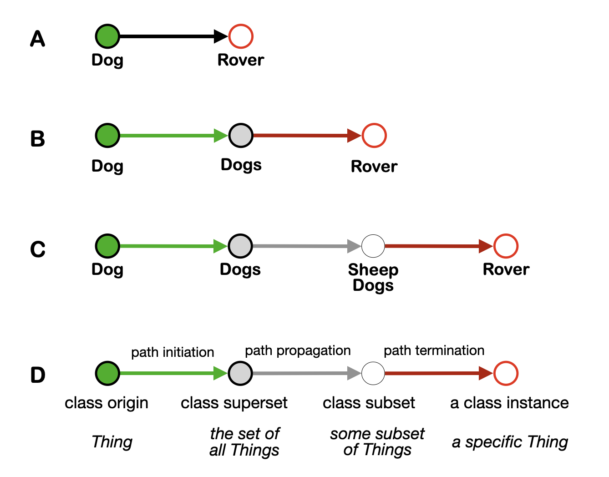
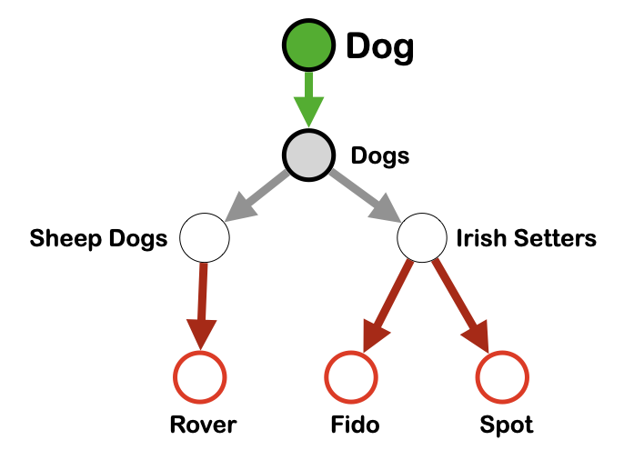
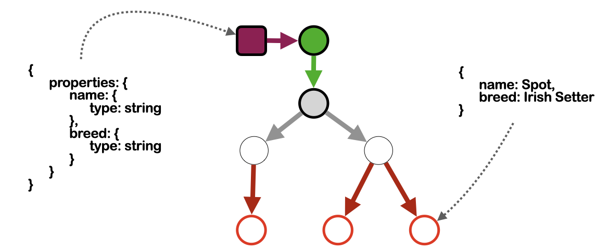
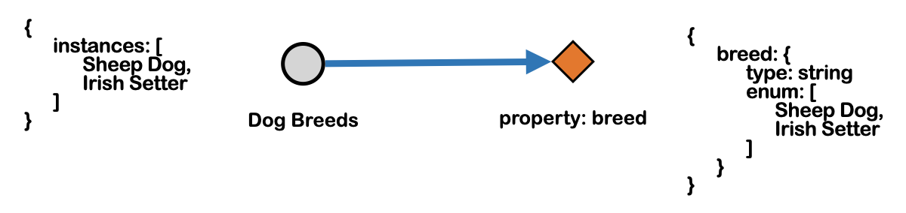
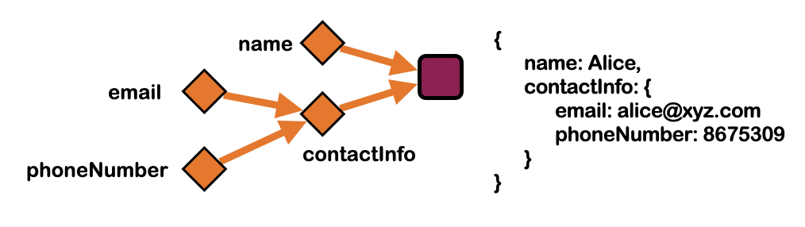
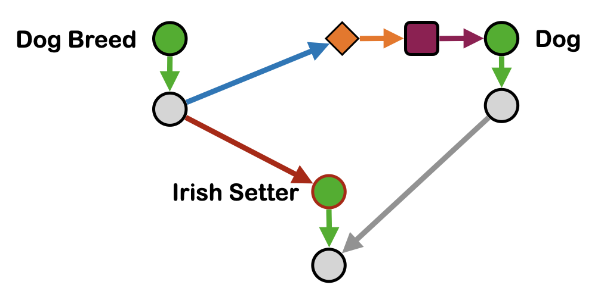

# The Cortical Tribal Tapestry Hypothesis

# Abstract 

Before we (USS and WDS4) can proceed with our celebrated Oprah Book Club selection and NYT Best Seller, *The Tribal Tapestry*, we must first come to an agreement as to 1) what the Cortical Tribal Tapestry Hypothesis actually states and 2) whether it is well formulated, novel, plausibly true, and useful. If it does not meet ALL of those requirements, it means we have nothing new to say and there is no sense writing the book – unless we want to be charlatans, repackaging tired old ideas in a new wrapper, which neither one of us wants to do. Whether or not we present the full hypothesis in all its glorious detail in the book is another matter. Some parts may be too dry and boring. But leaving it out of the book doesn't mean we don't need to discuss it first. Because there’s no way to decide which parts to include without first coming to agreement on the model itself. Below, I present the model as a series of hypotheses, each of which layer upon the ones before it.

# The Claim

I claim that the CTTH is all of the following.

- well formulated: a coherent theory that is substantive and falsifiable
- novel
- plausible
- useful

# Counterclaim

- not substantive
- not novel
- implausible
- not useful

# Hypotheses

The CTTH is a series of hypotheses, listed below, each of which builds upon the ones before it.

## 1. The representation of knowledge in the brain is profoundly influenced by the mandate to facilitate *social linguistic consensus* (SLC).

The organization of the brain is determined primarily by the need to address the problem of [social linguistic consensus](https://github.com/wds4/tribal-tapestry/blob/main/glossary/socialLinguisticConsensus.md). We need a universal language to get the ball rolling. That universal language is methematics. Specifically: graph theory (see below) and set theory (see below).

## 2. Knowledge in the cortex is organized as a graph.

Knowledge is broken down into small chunks, called nodes, and organized into a graph. This is not exactly controversial or new. It's hard to imagine that this is NOT the case. But it's the launching pad for subsequent hypotheses.

Knowledge is represented in two layers: the *nodal layer* and the *topological layer*. First and foremost, the tapestry method is concerned with the principles of organization of the topological layer. Conversely, the tapestry method places no restrictions on the physical form and data format of individual nodes. In the biological realm, nodes are patches of neurons: cortical columns, cortical minicolumns, nuclei, or other structures. In the digital realm, a node is a digital file: a data file, an image file, anything. 

There are important differences between information storage between these two methods. The topological layer can store information more efficiently and is well suited as a means to search for patterns, discover new relationships, and generate hypotheses. However, information retrieval is much more efficient (faster) from the nodal layer. Much of the brain's "up time" is likely spent updating the graph with new information. Much of the brain's "down time" (sleep?) is likely spent on 1) the coputationally expensive process of mining the graph for data, the results of which can be stored in nodes, and 2) optimizations of graphical topology. I say this based on my experience applying the tapestry method in the digital realm.

## 3. The principles by which structure is imposed over the graph must be as simple and universal as possible.

Structure is imposed on the graph by *principles of organization*. The mandate to achieve social linguistic consensus dictates that these principles must be as simple and universal as possible.

(btw this is the part where Oprah's audience falls asleep. So might not include it in the book. But this is a large part of what makes the CTTH substantive, which is why WE need to talk about it.)

The first two principles of organization are the class thread principle and object principles.

## 4. Nodes of the graph are organized into sets and concepts using class threads.

  
    
  
  
  
    
  

Left: Definition of a class thread. It is defined by three edge types: path initiation, path propagation, and path termination. Path initiation and termination nodes are required. There can be any number of path propagation nodes, including zero.

Right: a concept is defined in terms of a class origin node: Given the set of all class threads that emanate from a single class origin node, a concept is defined as the set of all nodes and all edges that are traversed by those threads.

## 5. Concepts are formatted according to constraint nodes.  

  

  
## 6. Concepts are integrated vertically using the edges that make up class threads.

See Figure, below.
- Dog Breed and Irish Setter are connected vertically by the *path termination* edge (red arrow).
- Dog and Irish Setter are connected vertically by the *path propagation* edge (grey arrow).

## 7. Constraint nodes are decomposed into properties in a manner designed to facilitate and maximize horizontal integration of the graph.

See Fig. X. The "breed" property on the right is only allowed to have two values: Sheep Dog and Irish Setter, because those are the only two Dog Breeds that exist in the local database. We introduce a fourth edge type, the enumeration edge (blue arrow) to achieve horizontal integration of the concepts of Dog Breed and Dog.

  

Figure X. 

- Dog Breed and Dog are connected horizontally by the enumeration arror (blue arrow).

  
    
  
  
  
    
  

## 8. The tapestry is normalized.

Normalization means that every node is unique. The concept of normalization of a database is familiar to computer scientists and database engineers. Sometimes normalization is broken, and that happens in the CTTH, but there must always be a reason for breaking it. In the CTTH, normalization is likely broken for data redundancy (so you don't forget something important when you bump your head and microinfarct a single cortical column). See *The Thousand Brains Hypothesis* -- a very interesting book. Other reasons to break normalization also exist: multiple versions of the same node facilitate the opportinuty to experiment with minor variations to a given concept.

## 9. The topology of the tapestry is optimized to increase search efficiency.

Organization of the graph lends itself well to the algorithmic search for similarity in graphical topology between disparate regions,a.k.a. *analogies*, as well as other processes that well merit the label: *thinking*. However, such searches will be computationally very expensive. Background processing to optimze the tapestry for such searches will be important, and could be an important role for nonREM sleep.

## 10. Basic human * cognition employs two distinct modes to arrive at truth: the objective mode and the tribal mode.

* This probably applies to all social organisms.

There are two modalities that our brains process information to arrive at what our brains consider to be "the truth."

The objective mode is what we would call the scientific method.

The brain defaults to the objective mode except in very special circumstances when the tribal mode kicks in. Basically when the tribal narrative fiction demands it.

The tribal mode employs logical fallacy strategically to defend the tribal narrative fiction.

## 11 Toxicity serves a purpose: tribal acceptance.

The tribal narrative of most (all?) tribes contains toxic threads that serve a purpose: to set the narrative apart from all others.

The mandate as set forth by [social linguistic consensus](https://github.com/wds4/tribal-tapestry/blob/main/glossary/socialLinguisticConsensus.md) aims to be as maximally inclusive as possible.  and is predicated on the notion that acceptance by the tribe is predicated upon exclusion of The Other.

The mandate of tribal consensus represents a reversal of SLC: it is based upon exclusion rather than inclusion. If SLC social linguistic consensus, tribalism is antisocial linguistic consensus.

SLC aims to communicate with as many entities as possible. Tribalism aims to do the opposite: to break down into tribes. SLC facilitates influence; tribalism is the capitulation of influence in deference to power.

## 12. The Enlightenment and postmodernism represent the rejection of the tribal mode and the objective mode, respectively.

Postmodernism represents the attempt to enshrine toxicity in the search for Truth. The triumph of the tribal mindset over the objective mindset. 

Enlightenment represents the attempt to purge toxicity in the search for Truth. The triumph of the objective mindset over the tribal mindset.

## 13. The CTTH is universally toxic.

I called this the Prime Directive, but you did not like this name and I can never remember what name we replaced it with.

The reason the cortical tapestry hypothesis remains undiscovered by the neuroscience community is that it is universally toxic. The cortical tapestry hypothesis exists firmly within everyone's cognitive blond spot, as evidenced by the difficulty of finding vocabulary even to state the hypothesis that is not immediately rejected as pejorative, insulting, etc. There is no non-pejorative terminology for: toxic, objective versus tribal mindset, narrative fiction. 

# Utility

## 1. At the individual level: to maximize meaning, belonging, and acceptance while minimizing the costs accociated with tribalism. 

- to diagnose pathology internally, from within one's own tribe
- to diagnose pathology in The Other's tribe and inform our decisions regarding how to respond

## 2. May yield insights into normal brain function and brain pathology, including: 

- the function of sleep (see above)
- neurodegenerative dementia: why memory loss is retrograde
- Denial, a form of self deception, does NOT necessarily imply childhood trauma. 

## 3. Fun with philosophy.

The reason paradox is deep is because toxicity in service to the tribe is the literal definition of virtue, according to the tribal mode.

Question of the day: is tribal toxicity REALLY necessary? Could we resect it, like the spleen or appendix, and do fine without it? Maybe yes, but only in a world where conflicts were impossible?

